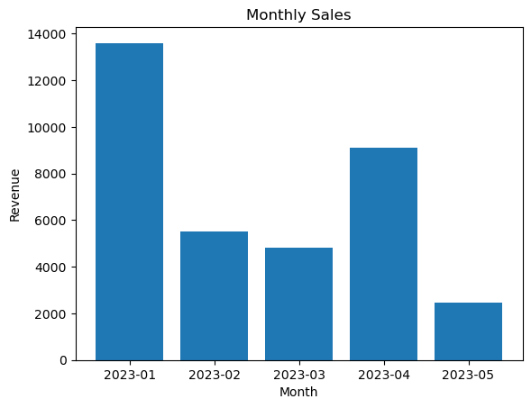

# AWS_Gen_AI
Developing Generative AI Applications on AWS

# Notebooks Detailed Explanations

## Interactive Index
- [Task 1: Data Preparation and Analysis](#task-1-data-preparation-and-analysis)
- [Task 2: Text Data Preprocessing](#task-2-text-data-preprocessing)
- [Task 3: Advanced NLP Techniques](#task-3-advanced-nlp-techniques)
- [Task 4: Building an RAG Model](#task-4-building-an-rag-model)
- [Task 5: Invoke Bedrock Model for Code Generation](#task-5-invoke-bedrock-model-for-code-generation)
- [Task 6: Bedrock Model Integration with LangChain Agents](#task-6-bedrock-model-integration-with-langchain-agents)

---

## Task 1: Data Preparation and Analysis

# Task 1a: Perform Text Generation

In this notebook, you learn how to use a Large Language Model (LLM) to generate an email response to a customer who provided negative feedback on the quality of customer service they received from the support engineer. You generate an email with a thank-you note based on the customer's previous email. You use the Amazon Titan model through the Amazon Bedrock API with the Boto3 client.

The prompt used in this task is called a zero-shot prompt. In a zero-shot prompt, you describe the task or desired output to the language model in plain language. The model then uses its pre-trained knowledge and capabilities to generate a response or complete the task based solely on the provided prompt.

#### Scenario
You are Bob, a Customer Service Manager at AnyCompany, and some of your customers are not happy with the customer service and are providing negative feedback on the service provided by customer support engineers. Now, you would like to respond to those customers, apologizing for the poor service and to regain trust. You need the help of an LLM to generate a bulk of emails for you which are human-friendly and personalized to the customer's sentiment from previous email correspondence.

### Task 1a.1: Environment Setup

In this task, you set up your environment.

#### Code Explanations:

##### Code Cell 1:
```python
# Create a service client by name using the default session.
import json
import os
import sys

import boto3
import botocore

module_path = ".."
sys.path.append(os.path.abspath(module_path))

bedrock_client = boto3.client('bedrock-runtime', region_name=os.environ.get("AWS_DEFAULT_REGION", None))
```
**Explanation:** This code sets up the environment by importing the required libraries and initializing a Boto3 client to connect with Amazon Bedrock. It also modifies the `sys.path` to include the specified directory, enabling imports from it if needed.

### Task 1a.2: Generate Text

In this task, you prepare an input for the Amazon Bedrock service to generate an email.

#### Code Explanations:

##### Code Cell 2:
```python
# Create the prompt
prompt_data = """
Command: Write an email from Bob, Customer Service Manager, AnyCompany to the customer "John Doe" 
who provided negative feedback on the service provided by our customer support 
engineer"""
```
**Explanation:** This cell defines the prompt that the model will use to generate the email response. The prompt provides context, specifying that Bob, a Customer Service Manager, is responding to negative feedback from a customer named John Doe.

##### Code Cell 3:
```python
body = json.dumps({
    "inputText": prompt_data, 
    "textGenerationConfig": {
        "maxTokenCount": 8192,
        "stopSequences": [],
        "temperature": 0,
        "topP": 0.9
    }
})
```
**Explanation:** This cell structures the request body with the prompt data and additional parameters for the model, such as `maxTokenCount`, `temperature`, and `topP`. These parameters control the response length, creativity, and likelihood of generating diverse responses.

### Task 1a.3: Invoke the Amazon Titan Large Language Model

In this task, you explore how the model generates an output based on the prompt created earlier.

#### Code Explanations:

##### Code Cell 4:
```python
# Invoke model
modelId = 'amazon.titan-text-express-v1'  # Change this to use a different version from the model provider
accept = 'application/json'
contentType = 'application/json'
outputText = "\n"
try:
    response = bedrock_client.invoke_model(
        body=body, modelId=modelId, accept=accept, contentType=contentType
    )
    response_body = json.loads(response.get('body').read())
    outputText = response_body.get('results')[0].get('outputText')
except botocore.exceptions.ClientError as error:
    if error.response['Error']['Code'] == 'AccessDeniedException':
        print(f"\x1b[41m{error.response['Error']['Message']}"
              "\nTo troubleshoot this issue please refer to the following resources."
              "\nhttps://docs.aws.amazon.com/IAM/latest/UserGuide/troubleshoot_access-denied.html"
              "\nhttps://docs.aws.amazon.com/bedrock/latest/userguide/security-iam.html\x1b[0m\n")
    else:
        raise error
```
**Explanation:** This cell sends a request to the Amazon Bedrock service with the specified model ID and configurations. It then extracts the generated response and handles any potential errors, such as access denial issues, displaying the appropriate troubleshooting information if needed.

##### Code Cell 5:
```python
# The relevant portion of the response begins after the first newline character
# Below we print the response beginning after the first occurrence of '\n'.

email = outputText[outputText.index('\n')+1:]
print(email)
```
**Explanation:** This code cell processes the output generated by the model and prints the final email response, starting from the first newline character in the response text.

### Complete Output Generation

This email is generated using the Amazon Titan model by understanding the input request and utilizing its inherent understanding of different modalities. The request to the API is synchronous and waits for the entire output to be generated by the model.

### Streaming Output Generation

Bedrock also supports that the output can be streamed as it is generated by the model in the form of chunks. This email is generated by invoking the model with streaming option. `invoke_model_with_response_stream` returns a `ResponseStream` which you can read from.

#### Code Explanations:

##### Code Cell 6:
```python
# Invoke model with response stream
output = []
try:
    response = bedrock_client.invoke_model_with_response_stream(
        body=body, modelId=modelId, accept=accept, contentType=contentType
    )
    stream = response.get('body')
    i = 1
    if stream:
        for event in stream:
            chunk = event.get('chunk')
            if chunk:
                chunk_obj = json.loads(chunk.get('bytes').decode())
                text = chunk_obj['outputText']
                output.append(text)
                print(f'\t\t\x1b[31m**Chunk {i}**\x1b[0m\n{text}\n')
                i += 1
except botocore.exceptions.ClientError as error:
    if error.response['Error']['Code'] == 'AccessDeniedException':
        print(f"\x1b[41m{error.response['Error']['Message']}"
              "\nTo troubleshoot this issue please refer to the following resources."
              "\nhttps://docs.aws.amazon.com/IAM/latest/UserGuide/troubleshoot_access-denied.html"
              "\nhttps://docs.aws.amazon.com/bedrock/latest/userguide/security-iam.html\x1b[0m\n")
    else:
        raise error
```
**Explanation:** This code demonstrates how to invoke the model using a streaming response to get real-time chunks of the generated text. This approach helps in cases where the model output is large, and getting immediate responses can improve user experience.

##### Code Cell 7:
```python
# Combine output chunks
print('\t\t\x1b[31m**COMPLETE OUTPUT**\x1b[0m\n')
complete_output = ''.join(output)
print(complete_output)
```
**Explanation:** Combines the individual chunks received from the streaming response into a single output and prints the complete generated response.

### Try it Yourself

- Change the prompts to your specific use case and evaluate the output of different models.
- Play with the token length to understand the latency and responsiveness of the service.
- Apply different prompt engineering principles to get better outputs.

### Cleanup

You have completed this notebook. To move to the next part of the lab, do the following:

- Close this notebook file and continue with **Task1b.ipynb**.

---

## Task 2: Text Data Preprocessing

# Task 1b: Perform Text Generation Using a Prompt That Includes Context

In this notebook, you learn how to generate an email response to a customer who was not happy with the quality of customer service they received from the customer support engineer. You provide additional context to the model by including the contents of the actual email received from the unhappy customer.

You add more complexity with the help of `PromptTemplates` to leverage the LangChain framework for a similar use case. `PromptTemplates` allow you to create generic shells which can be populated with information later and obtain model outputs based on different scenarios.

[LangChain](https://python.langchain.com/docs/get_started/introduction.html) is a framework for developing applications powered by language models. The key aspects of this framework allow us to augment the Large Language Models by chaining together various components to create advanced use cases.

Due to the additional context in the prompt, the content produced in this notebook is of much better quality and relevance than the content produced earlier through zero-shot prompts. The prompt used in this notebook creates a custom LangChain prompt template for adding context to the text generation request.

#### Scenario
You are Bob, a Customer Service Manager at AnyCompany, and some of your customers are not happy with the customer service and are providing negative feedback on the service provided by customer support engineers. Now, you would like to respond to those customers humbly, apologizing for the poor service and regain their trust. You need the help of a Large Language Model (LLM) to generate a bulk of emails for you, which are human-friendly and personalized to the customer's sentiment from previous email correspondence.

In this scenario, you can leverage the power of LangChain's `PromptTemplates` to create a generic shell for generating personalized email responses based on the customer's previous email. The `PromptTemplate` will incorporate the customer's original email content, allowing the LLM to understand the context and sentiment, and then generate a relevant and customized response.

### Task 1b.1: Environment Setup

In this task, you set up your environment.

#### Code Explanations:

##### Code Cell 1:
```python
# Create a service client by name using the default session.
import json
import os
import sys
import warnings

import boto3

warnings.filterwarnings('ignore')
module_path = ".."
sys.path.append(os.path.abspath(module_path))

bedrock_client = boto3.client('bedrock-runtime', region_name=os.environ.get("AWS_DEFAULT_REGION", None))
```
**Explanation:** Initializes the environment by importing libraries such as `warnings`, `boto3`, and setting up the Bedrock client using `boto3`. Suppresses warnings to keep the output clean and modifies the path for module imports.

### Task 1b.2: Invoke the Bedrock LLM Model

In this task, you create an instance of the Bedrock class from `llms`. This expects a `model_id` which is the Amazon Resource Name (ARN) of the model available in Amazon Bedrock.

Optionally, you can pass a previously created Boto3 client as well as some `model_kwargs` which can hold parameters such as `temperature`, `top_p`, `max_token_count`, or `stop_sequences` (more information on parameters can be explored in the Amazon Bedrock console).

Refer to [documentation](https://docs.aws.amazon.com/bedrock/latest/userguide/model-ids-arns.html) for available text generation model IDs under Amazon Bedrock.

**Note:** The different models support different `model_kwargs`.

#### Code Explanations:

##### Code Cell 2:
```python
# Model configuration
from langchain_aws import ChatBedrock
from langchain_core.output_parsers import StrOutputParser

model_id = "meta.llama3-8b-instruct-v1:0"
model_kwargs = {
    "max_gen_len": 512,
    "temperature": 0,
    "top_p": 1,
}

# LangChain class for chat
chat_model = ChatBedrock(
    client=bedrock_client,
    model_id=model_id,
    model_kwargs=model_kwargs,
)
```
**Explanation:** Configures the LangChain `ChatBedrock` model using the Amazon Bedrock client, with model parameters like `temperature` and `max_gen_len`. This setup is used for generating text outputs based on provided prompts.

### Task 1b.3: Create a LangChain Custom Prompt Template

In this task, you create a template for the prompt that you can pass different input variables on every run. This is useful when you have to generate content with different input variables that you may be fetching from a database.

In the previous task, we hardcoded the prompt. It might be the case that you have multiple customers sending similar negative feedback, and you now want to use each of those customers' emails and respond to them with an apology, but you also want to keep the response a bit personalized. In the following cell, you explore how you can create a `PromptTemplate` to achieve this pattern.

**Note:** You can safely ignore the warnings and proceed to the next cell.

#### Code Explanations:

##### Code Cell 3:
```python
# Create a prompt template that has multiple input variables
from langchain.prompts import PromptTemplate

multi_var_prompt = PromptTemplate(
    input_variables=["customerServiceManager", "customerName", "feedbackFromCustomer"], 
    template="""

Human: Create an apology email from the Service Manager {customerServiceManager} at AnyCompany to {customerName} in response to the following feedback that was received from the customer: 
<customer_feedback>
{feedbackFromCustomer}
</customer_feedback>

Assistant:"""
)

# Pass in values to the input variables
prompt = multi_var_prompt.format(
    customerServiceManager="Bob Smith", 
    customerName="John Doe", 
    feedbackFromCustomer="""Hello Bob,
 I am very disappointed with the recent experience I had when I called your customer support.
 I was expecting an immediate call back but it took three days for us to get a call back.
 The first suggestion to fix the problem was incorrect. Ultimately the problem was fixed after three days.
 We are very unhappy with the response provided and may consider taking our business elsewhere.
 """
)
```
**Explanation:** Creates a prompt template with placeholders for variables like `customerServiceManager`, `customerName`, and `feedbackFromCustomer`. The template is filled with values and formatted to produce a specific prompt for the LLM.

##### Code Cell 4:
```python
# Get number of tokens
num_tokens = chat_model.get_num_tokens(prompt)
print(f"Our prompt has {num_tokens} tokens")
```
**Explanation:** Calculates the number of tokens in the prompt to ensure it doesn't exceed the model's context limit, which can affect the model's performance and response generation.

##### Code Cell 5:
```python
# Invoke
response = chat_model.invoke(prompt)
```
**Explanation:** Invokes the model with the formatted prompt and retrieves the generated response based on the given customer feedback and context.

##### Code Cell 6:
```python
# Configure a Chain to parse output
chain = StrOutputParser()
formatted_response = chain.invoke(response)
print(formatted_response)
```
**Explanation:** Configures a chain that parses the response from the model, making it easier to extract and format the output for display.

You have successfully learned that invoking the LLM without any context might not yield the desired results. By adding context and further using the prompt template to constrain the output from the LLM, you were able to successfully obtain your desired output.

### Try it Yourself

- Change the prompts to your specific use case and evaluate the output of different models.
- Play with the token length to understand the latency and responsiveness of the service.
- Apply different prompt engineering principles to get better outputs.

### Cleanup

You have completed this notebook. To move to the next part of the lab, do the following:

- Close this notebook file.
- Return to the lab session and continue with **Task 2**.

---

## Task 3: Advanced NLP Techniques

# Task 2a: Text Summarization with Small Files Using Titan Text Premier

In this notebook, you ingest a small string of text directly into the Amazon Bedrock API (using the Titan Text model) and instruct it to summarize the input text. You can apply this approach to summarize call transcripts, meeting transcripts, books, articles, blog posts, and other relevant content when the input text length is within the context size limits of the model.

### Task 2a.1: Environment Setup

In this task, you set up your environment.

#### Code Explanations:

##### Code Cell 1:
```python
# Create a service client by name using the default session.
import json
import os
import sys
import warnings

import boto3
import botocore

warnings.filterwarnings('ignore')
module_path = ".."
sys.path.append(os.path.abspath(module_path))

bedrock_client = boto3.client('bedrock-runtime', region_name=os.environ.get("AWS_DEFAULT_REGION", None))
```
**Explanation:** Sets up the environment for text summarization by importing necessary libraries and creating a Bedrock client using Boto3. It also modifies the module path for importing additional resources if needed.

### Task 2a.2: Writing Prompt with Text to Be Summarized

In this task, you use a short passage of text with fewer tokens than the maximum length supported by the foundation model. As a sample input text for this lab, you use a paragraph from an [AWS blog post](https://aws.amazon.com/jp/blogs/machine-learning/announcing-new-tools-for-building-with-generative-ai-on-aws/) announcing Amazon Bedrock.

The prompt starts with an instruction `Please provide a summary of the following text.`

#### Code Explanations:

##### Code Cell 2:
```python
prompt_data = """

Please provide a summary of the following text:

AWS took all of that feedback from customers, and today we are excited to announce Amazon Bedrock, \
a new service that makes FMs from AI21 Labs, Anthropic, Stability AI, and Amazon accessible via an API. \
Bedrock is the easiest way for customers to build and scale generative AI-based applications using FMs, \
democratizing access for all builders. Bedrock will offer the ability to access a range of powerful FMs \
for text and images—including Amazons Titan FMs, which consist of two new LLMs we’re also announcing \
today—through a scalable, reliable, and secure AWS managed service. With Bedrock’s serverless experience, \
customers can easily find the right model for what they’re trying to get done, get started quickly, privately \
customize FMs with their own data, and easily integrate and deploy them into their applications using the AWS \
tools and capabilities they are familiar with, without having to manage any infrastructure (including integrations \
with Amazon SageMaker ML features like Experiments to test different models and Pipelines to manage their FMs at scale).
"""
```
**Explanation:** Defines the text to be summarized as a prompt. The prompt includes detailed information about Amazon Bedrock and its features to be summarized by the Titan Text model.

### Task 2a.3: Creating Request Body with Prompt and Inference Parameters

In this task, you create the request body with the above prompt and inference parameters.

#### Code Explanations:

##### Code Cell 3:
```python
# Request body
body = json.dumps({
    "inputText": prompt_data, 
    "textGenerationConfig": {
        "maxTokenCount": 2048,
        "stopSequences": [],
        "temperature": 0,
        "topP": 0.9
    }
})
```
**Explanation:** Creates a request body with the prompt data and configures model parameters like `maxTokenCount` and `temperature` to control the generated summary output.

### Task 2a.4: Invoke Foundation Model via Boto3

In this task, you send an API request to Amazon Bedrock specifying the request parameters: `modelId`, `accept`, and `contentType`. Following the provided prompt, the foundation model in Amazon Bedrock then summarizes the input text.

#### Code Explanations:

##### Code Cell 4:
```python
# Model configuration and invoke the model
modelId = 'amazon.titan-text-premier-v1:0'  # Change this to use a different version from the model provider
accept = 'application/json'
contentType = 'application/json'
outputText = "\n"

try:
    response = bedrock_client.invoke_model(
        body=body, modelId=modelId, accept=accept, contentType=contentType
    )
    response_body = json.loads(response.get('body').read())
    outputText = response_body.get('results')[0].get('outputText')
except botocore.exceptions.ClientError as error:
    if error.response['Error']['Code'] == 'AccessDeniedException':
        print(f"\x1b[41m{error.response['Error']['Message']}"
              "\nTo troubleshoot this issue please refer to the following resources."
              "\nhttps://docs.aws.amazon.com/IAM/latest/UserGuide/troubleshoot_access-denied.html"
              "\nhttps://docs.aws.amazon.com/bedrock/latest/userguide/security-iam.html\x1b[0m\n")
    else:
        raise error

print(outputText)
```
**Explanation:** Invokes the Titan model to generate the complete summary for the input text. Handles potential errors and prints the output summary.

### Streaming Output Generation

Next, you explore how to use Amazon Bedrock's `invoke_model_with_response_stream` API to stream model outputs so users can consume outputs as they are generated. Rather than generating the full output at once, this API returns a `ResponseStream` that sends smaller output chunks from the model as they are produced. You can display these streaming outputs in a continuous, consumable view.

#### Code Explanations:

##### Code Cell 5:
```python
# Invoke model with response stream
modelId = 'amazon.titan-text-premier-v1:0'
response = bedrock_client.invoke_model_with_response_stream(
    body=body, modelId=modelId, accept=accept, contentType=contentType
)
stream = response.get('body')
output = list(stream)
output
```
**Explanation:** Streams the response from the model using the `invoke_model_with_response_stream` API, displaying the output incrementally as it is generated, which is useful for longer summaries.

##### Code Cell 6:
```python
from IPython.display import display_markdown, Markdown, clear_output
```
**Explanation:** Imports display utilities from `IPython.display` to visualize and clear markdown outputs for a cleaner display of streamed content.

##### Code Cell 7:
```python
modelId = 'amazon.titan-text-premier-v1:0'
response = bedrock_client.invoke_model_with_response_stream(
    body=body, modelId=modelId, accept=accept, contentType=contentType
)
stream = response.get('body')
output = []
i = 1
if stream:
    for event in stream:
        chunk = event.get('chunk')
        if chunk:
            chunk_obj = json.loads(chunk.get('bytes').decode())
            text = chunk_obj['outputText']
            clear_output(wait=True)
            output.append(text)
            display_markdown(Markdown(''.join(output)))
            i += 1
```
**Explanation:** Streams the response, collects chunks incrementally, and displays them as the response is generated. This approach helps maintain a continuous flow of output for the user.

### Try it Yourself

- Change the prompts to your specific use case and evaluate the output of different models.
- Play with the token length to understand the latency and responsiveness of the service.
- Apply different prompt engineering principles to get better outputs.

### Cleanup

You have completed this notebook. To move to the next part of the lab, do the following:

- Close this notebook file and continue with **Task2b.ipynb**.

---

## Task 4: Building an RAG Model

# Task 2b: Abstractive Text Summarization

In this notebook, you manage challenges arising in large document summarization—input text can exceed model context lengths, generate hallucinated outputs, or trigger out-of-memory errors.

To mitigate these issues, this notebook demonstrates an architecture using prompt chunking and chaining with the [LangChain](https://python.langchain.com/docs/get_started/introduction.html) framework, a toolkit enabling applications leveraging language models.

You explore an approach addressing scenarios when user documents surpass token limits. Chunking splits documents into segments under context length thresholds before sequentially feeding them to models. This chains prompts across chunks, retaining prior context. You apply this approach to summarize call transcripts, meeting transcripts, books, articles, blog posts, and other relevant content.

### Task 2b.1: Environment Setup

#### Code Explanations:

##### Code Cell 1:
```python
# Create a service client by name using the default session.
import json
import os
import sys

import boto3

module_path = ".."
sys.path.append(os.path.abspath(module_path))
bedrock_client = boto3.client('bedrock-runtime', region_name=os.environ.get("AWS_DEFAULT_REGION", None))
```
**Explanation:** Initializes the environment by importing necessary libraries and creating a Bedrock client using Boto3. Modifies the system path to include the module directory.

### Task 2b.2: Summarize Long Text

#### Code Explanations:

##### Code Cell 2:
```python
# Model configuration
from langchain_aws import BedrockLLM
modelId = "meta.llama3-8b-instruct-v1:0"
llm = BedrockLLM(
    model_id=modelId,
    model_kwargs={
        "max_gen_len": 2048,
        "temperature": 0,
        "top_p": 1
    },
    client=bedrock_client
)
```
**Explanation:** Configures the LangChain `BedrockLLM` model with the specified model ID and parameters suitable for summarization tasks.

### Task 2b.3: Loading a Text File with Many Tokens

#### Code Explanations:

##### Code Cell 3:
```python
# Get tokens
shareholder_letter = "../letters/2022-letter.txt"

with open(shareholder_letter, "r") as file:
    letter = file.read()

llm.get_num_tokens(letter)
```
**Explanation:** Reads the text file and calculates the number of tokens to ensure it doesn't exceed the model's context window.

### Task 2b.4: Splitting the Long Text into Chunks

#### Code Explanations:

##### Code Cell 4:
```python
# Chunking
from langchain.text_splitter import RecursiveCharacterTextSplitter
text_splitter = RecursiveCharacterTextSplitter(
    separators=["\n\n", "\n"], chunk_size=4000, chunk_overlap=100
)

docs = text_splitter.create_documents([letter])
```
**Explanation:** Splits the long text into manageable chunks that fit within the model's context window.

##### Code Cell 5:
```python
num_docs = len(docs)
num_tokens_first_doc = llm.get_num_tokens(docs[0].page_content)

print(
    f"Now we have {num_docs} documents and the first one has {num_tokens_first_doc} tokens"
)
```
**Explanation:** Prints the number of documents and the token count of the first document to verify the splitting.

### Task 2b.5: Summarizing Chunks and Combining Them

#### Code Explanations:

##### Code Cell 6:
```python
# Load summarize chain
from langchain.chains.summarize import load_summarize_chain
summary_chain = load_summarize_chain(llm=llm, chain_type="map_reduce", verbose=False)
```
**Explanation:** Loads a summarization chain that uses the `map_reduce` method to handle large texts.

##### Code Cell 7:
```python
# Invoke chain
output = ""
try:
    output = summary_chain.invoke(docs)
except ValueError as error:
    if "AccessDeniedException" in str(error):
        print(f"\x1b[41m{error}"
              "\nTo troubleshoot this issue please refer to the following resources."
              "\nhttps://docs.aws.amazon.com/IAM/latest/UserGuide/troubleshoot_access-denied.html"
              "\nhttps://docs.aws.amazon.com/bedrock/latest/userguide/security-iam.html\x1b[0m\n")
        class StopExecution(ValueError):
            def _render_traceback_(self):
                pass
        raise StopExecution
    else:
        raise error
```
**Explanation:** Invokes the summarization chain and handles exceptions, particularly access issues.

##### Code Cell 8:
```python
# Print output
print(output['output_text'])
```
**Explanation:** Prints the final summarized text.

### Try it Yourself

- Change the prompts to suit your use case.
- Adjust token lengths to observe effects on latency and performance.
- Experiment with different prompt engineering techniques.

### Cleanup

You have completed this notebook. Close this notebook and proceed to **Task 3**.

---

## Task 5: Invoke Bedrock Model for Code Generation

# Task 3: Use Amazon Bedrock for Question Answering

In this notebook, you use the Bedrock Titan model to answer questions by providing the relevant context within the prompt. This approach addresses the challenge of returning factual answers without needing to index documents beforehand.

This simulates a Retrieval-Augmented Generation (RAG) setup but does not implement RAG. It is suitable for short documents or singleton applications but may not scale to enterprise-level question answering.

### Scenario

You are at AnyCompany and need to provide specific information about changing tires for a particular vehicle model. Initially, you ask the model without providing additional context and observe that it gives generic answers, which may not be accurate for your specific model.

To improve accuracy, you provide an excerpt from the vehicle's manual within the prompt, allowing the model to generate answers based on this specific context.

### Task 3.1: Environment Setup

#### Code Explanations:

##### Code Cell 1:
```python
# Setup environment
import json
import os
import sys
import warnings

import boto3
import botocore

warnings.filterwarnings('ignore')
module_path = ".."
sys.path.append(os.path.abspath(module_path))
bedrock_client = boto3.client('bedrock-runtime', region_name=os.environ.get("AWS_DEFAULT_REGION", None))
```
**Explanation:** Sets up the environment and initializes the Bedrock client.

### Task 3.2: Q&A with the Model's Knowledge

#### Code Explanations:

##### Code Cell 2:
```python
prompt_data = """You are a helpful assistant. Answer questions in a concise way. If you are unsure about the
answer say 'I am unsure'

Question: How can I fix a flat tire on my AnyCompany AC8?
Answer:"""
parameters = {
    "maxTokenCount": 512,
    "stopSequences": [],
    "temperature": 0,
    "topP": 0.9
}
```
**Explanation:** Constructs a prompt to query the model and sets parameters for response generation.

### Task 3.3: Invoke the Model

#### Code Explanations:

##### Code Cell 3:
```python
# Invoke model
body = json.dumps({"inputText": prompt_data, "textGenerationConfig": parameters})
modelId = "amazon.titan-text-express-v1"
accept = "application/json"
contentType = "application/json"
try:
    response = bedrock_client.invoke_model(
        body=body, modelId=modelId, accept=accept, contentType=contentType
    )
    response_body = json.loads(response.get("body").read())
    answer = response_body.get("results")[0].get("outputText")
    print(answer.strip())
except botocore.exceptions.ClientError as error:
    if error.response['Error']['Code'] == 'AccessDeniedException':
        print(f"\x1b[41m{error.response['Error']['Message']}"
              "\nTo troubleshoot this issue please refer to the following resources."
              "\nhttps://docs.aws.amazon.com/IAM/latest/UserGuide/troubleshoot_access-denied.html"
              "\nhttps://docs.aws.amazon.com/bedrock/latest/userguide/security-iam.html\x1b[0m\n")
        class StopExecution(ValueError):
            def _render_traceback_(self):
                pass
        raise StopExecution
    else:
        raise error
```
**Explanation:** Invokes the model and handles any access exceptions.

### Task 3.4: Provide Context to the Model

#### Code Explanations:

##### Code Cell 4:
```python
context = """[Insert detailed vehicle manual excerpt here]"""
```
**Explanation:** Defines the context from the vehicle's manual.

##### Code Cell 5:
```python
question = "How can I fix a flat tire on my AnyCompany AC8?"
prompt_data = f"""Answer the question based only on the information provided between ## and give step-by-step guide.
#
{context}
#

Question: {question}
Answer:"""
```
**Explanation:** Combines the context and question into a single prompt.

##### Code Cell 6:
```python
# Invoke model with context
body = json.dumps({"inputText": prompt_data, "textGenerationConfig": parameters})
response = bedrock_client.invoke_model(
    body=body, modelId=modelId, accept=accept, contentType=contentType
)
response_body = json.loads(response.get("body").read())
answer = response_body.get("results")[0].get("outputText")
print(answer.strip())
```
**Explanation:** Invokes the model with the context-enhanced prompt.

### Task 3.5: Streaming Output Generation

#### Code Explanations:

##### Code Cell 7:
```python
from IPython.display import display_markdown, Markdown, clear_output

# Response with stream
response = bedrock_client.invoke_model_with_response_stream(
    body=body, modelId=modelId, accept=accept, contentType=contentType
)
stream = response.get('body')
output = []
if stream:
    for event in stream:
        chunk = event.get('chunk')
        if chunk:
            chunk_obj = json.loads(chunk.get('bytes').decode())
            text = chunk_obj['outputText']
            clear_output(wait=True)
            output.append(text)
            display_markdown(Markdown(''.join(output)))
```
**Explanation:** Utilizes streaming to display the response as it's generated.

### Try it Yourself

- Modify the prompts and observe the changes.
- Experiment with different context lengths.
- Apply various prompt engineering techniques.

### Cleanup

Close this notebook and proceed to **Task 4**.

---

## Task 6: Bedrock Model Integration with LangChain Agents

# Task 4: Conversational Interface - Chat with Llama 3 and Titan Premier LLMs

In this notebook, you build a chatbot using the `llama3-8b-instruct` and `titan-text-premier` Foundation Models (FMs) in Amazon Bedrock.

Conversational interfaces such as chatbots and virtual assistants can enhance the user experience for your customers. Chatbots use natural language processing (NLP) and machine learning algorithms to understand and respond to user queries. You can use chatbots in a variety of applications, such as customer service, sales, and e-commerce, to provide quick and efficient responses to users. Users can access them through various channels such as websites, social media platforms, and messaging apps.

- **Chatbot (Basic)**: Zero-shot chatbot with a FM model.
- **Chatbot using prompt template (LangChain)**: Chatbot with some context provided in the prompt template.
- **Chatbot with persona**: Chatbot with defined roles, e.g., Career Coach and Human interactions.
- **Context-aware chatbot**: Passing in context through an external file by generating embeddings.

### Task 4.1: Environment Setup

#### Code Explanations:

##### Code Cell 1:
```python
# Ignore warnings and create a service client by name using the default session.
import json
import os
import sys
import warnings

import boto3

warnings.filterwarnings('ignore')
module_path = ".."
sys.path.append(os.path.abspath(module_path))
bedrock_client = boto3.client('bedrock-runtime', region_name=os.environ.get("AWS_DEFAULT_REGION", None))
```
**Explanation:** Sets up the environment and creates a service client for Bedrock integration with LangChain.

### Task 4.2: Using Chat History from LangChain to Start the Conversation

#### Code Explanations:

##### Code Cell 2:
```python
# Format instructions into a conversational prompt
from typing import Dict, List

def format_instructions(instructions: List[Dict[str, str]]) -> List[str]:
    """Format instructions where conversation roles must alternate system/user/assistant/user/assistant/..."""
    prompt: List[str] = []
    for instruction in instructions:
        if instruction["role"] == "system":
            prompt.extend(["<|begin_of_text|><|start_header_id|>system<|end_header_id|>\n", (instruction["content"]).strip(), " <|eot_id|>"])
        elif instruction["role"] == "user":
            prompt.extend(["<|start_header_id|>user<|end_header_id|>\n", (instruction["content"]).strip(), " <|eot_id|>"])
        else:
            raise ValueError(f"Invalid role: {instruction['role']}. Role must be either 'user' or 'system'.")
    prompt.extend(["<|start_header_id|>assistant<|end_header_id|>\n"])
    return "".join(prompt)
```
**Explanation:** Defines a function `format_instructions` to structure a list of instructions into a prompt format that the conversational model can understand.

##### Code Cell 3:
```python
from langchain_core.chat_history import InMemoryChatMessageHistory
from langchain_core.output_parsers import StrOutputParser
from langchain_core.prompts import ChatPromptTemplate
from langchain_core.runnables.history import RunnableWithMessageHistory
from langchain_aws import ChatBedrock

chat_model = ChatBedrock(
    model_id="meta.llama3-8b-instruct-v1:0", 
    client=bedrock_client
)

prompt = ChatPromptTemplate.from_messages(
    [
        ("system", "Answer the following questions as best you can."),
        ("placeholder", "{chat_history}"),
        ("human", "{input}"),
    ]
)

history = InMemoryChatMessageHistory()

def get_history():
    return history

chain = prompt | chat_model | StrOutputParser()

wrapped_chain = RunnableWithMessageHistory(
    chain,
    get_history,
    history_messages_key="chat_history",
)

query = "how are you?"
response = wrapped_chain.invoke({"input": query})
# Printing history to see the history being built out.
print(history)
# For the rest of the conversation, the output will only include response
```
**Explanation:** Sets up the conversation chain using LangChain components and initializes the chat history.

##### Code Cell 4:
```python
# New questions
instructions = [{"role": "user", "content": "Give me a few tips on how to start a new garden."}]
response = wrapped_chain.invoke({"input": format_instructions(instructions)})
print(response)
```
**Explanation:** Sends a new question to the model and prints the response.

##### Code Cell 5:
```python
# Build on the questions
instructions = [{"role": "user", "content": "bugs"}]
response = wrapped_chain.invoke({"input": format_instructions(instructions)})
print(response)
```
**Explanation:** Continues the conversation, testing the model's ability to maintain context.

##### Code Cell 6:
```python
# Finishing the conversation
instructions = [{"role": "user", "content": "That's all, thank you!"}]
response = wrapped_chain.invoke({"input": format_instructions(instructions)})
print(response)
```
**Explanation:** Ends the conversation gracefully.

### Task 4.3: Chatbot Using Prompt Template (LangChain)

#### Code Explanations:

##### Code Cell 7:
```python
# Prompt for a conversational agent
def format_prompt(actor: str, input: str):
    formatted_prompt: List[str] = []
    if actor == "system":
        prompt_template = """<|begin_of_text|><|start_header_id|>{actor}<|end_header_id|>\n{input}<|eot_id|>"""
    elif actor == "user":
        prompt_template = """<|start_header_id|>{actor}<|end_header_id|>\n{input}<|eot_id|>"""
    else:
        raise ValueError(f"Invalid role: {actor}. Role must be either 'user' or 'system'.")   
    prompt = PromptTemplate.from_template(prompt_template)     
    formatted_prompt.extend(prompt.format(actor=actor, input=input))
    formatted_prompt.extend(["<|start_header_id|>assistant<|end_header_id|>\n"])
    return "".join(formatted_prompt)
```
**Explanation:** Creates a prompt formatting function to handle different roles in the conversation.

##### Code Cell 8:
```python
# Chat user experience
import ipywidgets as ipw
from IPython.display import display, clear_output

class ChatUX:
    """A chat UX using IPWidgets"""
    def __init__(self, qa, retrievalChain=False):
        self.qa = qa
        self.name = None
        self.b = None
        self.retrievalChain = retrievalChain
        self.out = ipw.Output()

    def start_chat(self):
        print("Starting chat bot")
        display(self.out)
        self.chat(None)

    def chat(self, _):
        if self.name is None:
            prompt = ""
        else: 
            prompt = self.name.value
        if 'q' == prompt or 'quit' == prompt or 'Q' == prompt:
            with self.out:
                print("Thank you, that was a nice chat!!")
            return
        elif len(prompt) > 0:
            with self.out:
                thinking = ipw.Label(value="Thinking...")
                display(thinking)
                try:
                    if self.retrievalChain:
                        response = self.qa.invoke({"input": prompt})
                        result = response['answer']
                    else:
                        instructions = [{"role": "user", "content": prompt}]
                        result = self.qa.invoke({"input": format_instructions(instructions)})
                except:
                    result = "No answer"
                thinking.value = ""
                print(f"AI: {result}")
                self.name.disabled = True
                self.b.disabled = True
                self.name = None

        if self.name is None:
            with self.out:
                self.name = ipw.Text(description="You:", placeholder='q to quit')
                self.b = ipw.Button(description="Send")
                self.b.on_click(self.chat)
                display(ipw.Box(children=(self.name, self.b)))
```
**Explanation:** Defines a chat user interface using IPython widgets.

##### Code Cell 9:
```python
# Start chat
history = InMemoryChatMessageHistory()  # Reset chat history
chat = ChatUX(wrapped_chain)
chat.start_chat()
```
**Explanation:** Initializes and starts the chat interface.

### Task 4.4: Chatbot with Persona

#### Code Explanations:

##### Code Cell 11:
```python
prompt = ChatPromptTemplate.from_messages(
    [
        ("system", "You will be acting as a career coach. Your goal is to give career advice to users. For questions that are not career-related, don't provide advice. Say, I don't know."),
        ("placeholder", "{chat_history}"),
        ("human", "{input}"),
    ]
)

history = InMemoryChatMessageHistory()  # Reset history

chain = prompt | chat_model | StrOutputParser()

wrapped_chain = RunnableWithMessageHistory(
    chain,
    get_history,
    history_messages_key="career_chat_history",
)

response = wrapped_chain.invoke({"input": "What are the career options in AI?"})
print(response)
```
**Explanation:** Sets up the chatbot with a specific persona (career coach) and tests it.

##### Code Cell 12:
```python
response = wrapped_chain.invoke({"input": "How to fix my car?"})
print(response)
```
**Explanation:** Tests the chatbot's ability to stay within its defined persona.

### Task 4.5: Chatbot with Context

#### Code Explanations:

##### Code Cell 14:
```python
# Model configuration
from langchain_aws.embeddings import BedrockEmbeddings
from langchain.vectorstores import FAISS
from langchain.prompts import PromptTemplate

br_embeddings = BedrockEmbeddings(model_id="amazon.titan-embed-text-v1", client=bedrock_client)
```
**Explanation:** Sets up the embeddings model for vector representation.

##### Code Cell 15:
```python
# Vector store
from langchain.document_loaders import CSVLoader
from langchain.text_splitter import CharacterTextSplitter
from langchain.indexes.vectorstore import VectorStoreIndexWrapper

loader = CSVLoader("../rag_data/Amazon_SageMaker_FAQs.csv")
documents_aws = loader.load()
print(f"Documents loaded: size={len(documents_aws)}")

docs = CharacterTextSplitter(chunk_size=2000, chunk_overlap=400, separator=",").split_documents(documents_aws)
print(f"Documents after split and chunking: size={len(docs)}")

vectorstore_faiss_aws = FAISS.from_documents(
    documents=docs,
    embedding=br_embeddings,
)
print("Vector store created.")
```
**Explanation:** Loads documents, splits them, and creates a vector store using FAISS.

##### Code Cell 16:
```python
chat_llm = ChatBedrock(
    model_id="amazon.titan-text-premier-v1:0",
    client=bedrock_client
)
# Wrapper store FAISS
wrapper_store_faiss = VectorStoreIndexWrapper(vectorstore=vectorstore_faiss_aws)
print(wrapper_store_faiss.query("R in SageMaker", llm=chat_llm))
```
**Explanation:** Sets up a retriever and performs a query to test the vector store.

##### Code Cell 17:
```python
from langchain.chains import create_retrieval_chain
from langchain.chains.combine_documents import create_stuff_documents_chain
from langchain_core.prompts import ChatPromptTemplate

system_prompt = (
    "You are an assistant for question-answering tasks. "
    "Use the following pieces of retrieved context to answer "
    "the question. If you don't know the answer, say that you "
    "don't know. Use three sentences maximum and keep the "
    "answer concise."
    "\n\n"
    "{context}"
)

prompt = ChatPromptTemplate.from_messages(
    [
        ("system", system_prompt),
        ("human", "{input}"),
    ]
)

retriever = vectorstore_faiss_aws.as_retriever()
question_answer_chain = create_stuff_documents_chain(chat_llm, prompt)
rag_chain = create_retrieval_chain(retriever, question_answer_chain)

response = rag_chain.invoke({"input": "What is SageMaker?"})
print(response)
```
**Explanation:** Creates a retrieval chain for question answering based on retrieved context.

##### Code Cell 18:
```python
chat = ChatUX(rag_chain, retrievalChain=True)
chat.start_chat()  # Only answers will be shown here, and not the citations
```
**Explanation:** Starts the chat interface with retrieval-based responses.

### Try it Yourself

- Change the prompts to your specific use case.
- Experiment with different models and parameters.
- Apply various prompt engineering techniques.

### Cleanup

You have completed this notebook. Close this notebook file and continue with **Task 5**.

---


### Task 5: Invoke Bedrock Model for Code Generation

In this task, you learn how to use a Large Language Model (LLM) to generate code based on a text prompt.

The prompt used in this notebook is a zero-shot prompt, as we are not providing any examples other than the prompt itself.

To demonstrate the code generation capability of models in Amazon Bedrock, you take the use case of analyzing sales data. You explore using the Boto3 client to communicate with the Amazon Bedrock API and provide the API with an input consisting of a task and instructions for the model to generate code without any additional examples. This demonstrates how powerful LLMs can understand the task at hand and generate compelling outputs.

#### Scenario

You are Moe, a Data Analyst at AnyCompany. The company wants to understand its sales performance for different products over the past year. You have been provided a dataset named `sales.csv`. The dataset contains the following columns:

- `date` (YYYY-MM-DD format)
- `product_id` (unique identifier for each product)
- `price` (price at which each product was sold)
- `units_sold` (number of units sold)

In this notebook, you learn how to generate code for a given prompt. You use the Meta Llama 3 model using the Amazon Bedrock API with the Boto3 client.

### Task 5.1: Environment Setup

In this task, you set up your environment.

#### Code Cell 1:

```python
# Create a service client by name using the default session.
import json
import os
import sys

import boto3

module_path = ".."
sys.path.append(os.path.abspath(module_path))
bedrock_client = boto3.client('bedrock-runtime', region_name=os.environ.get("AWS_DEFAULT_REGION", None))
```

**Explanation:** Initializes the environment by importing necessary libraries and creating a Bedrock client using Boto3. Modifies the system path to include the module directory.

### Task 5.2: Code Generation

In this task, you prepare an input for the Amazon Bedrock service to generate a Python program for your use case.

#### Lab Setup - Create Sample `sales.csv` Data for This Lab

#### Code Cell 2:

```python
# Create sales.csv file
import csv

data = [
    ["date", "product_id", "price", "units_sold"],
    ["2023-01-01", "P001", 50, 20],
    ["2023-01-02", "P002", 60, 15],
    ["2023-01-03", "P001", 50, 18],
    ["2023-01-04", "P003", 70, 30],
    ["2023-01-05", "P001", 50, 25],
    ["2023-01-06", "P002", 60, 22],
    ["2023-01-07", "P003", 70, 24],
    ["2023-01-08", "P001", 50, 28],
    ["2023-01-09", "P002", 60, 17],
    ["2023-01-10", "P003", 70, 29],
    ["2023-02-11", "P001", 50, 23],
    ["2023-02-12", "P002", 60, 19],
    ["2023-02-13", "P001", 50, 21],
    ["2023-02-14", "P003", 70, 31],
    ["2023-03-15", "P001", 50, 26],
    ["2023-03-16", "P002", 60, 20],
    ["2023-03-17", "P003", 70, 33],
    ["2023-04-18", "P001", 50, 27],
    ["2023-04-19", "P002", 60, 18],
    ["2023-04-20", "P003", 70, 32],
    ["2023-04-21", "P001", 50, 22],
    ["2023-04-22", "P002", 60, 16],
    ["2023-04-23", "P003", 70, 34],
    ["2023-05-24", "P001", 50, 24],
    ["2023-05-25", "P002", 60, 21]
]

# Write data to sales.csv
with open('sales.csv', 'w', newline='') as csvfile:
    writer = csv.writer(csvfile)
    writer.writerows(data)

print("sales.csv has been created!")
```

**Explanation:** Creates a sample `sales.csv` file with sales data to be used in this lab.

**Output:**

```
sales.csv has been created!
```

### Task 5.3: Analyzing Sales with Amazon Bedrock Generated Python Program

#### Code Cell 3:

```python
# Define prompt template
from langchain_core.prompts import PromptTemplate

def format_prompt(actor: str, input_text: str):
    if actor == "user":
        prompt_template = """<|begin_of_text|><|start_header_id|>{actor}<|end_header_id|>

{input}<|eot_id|><|start_header_id|>assistant<|end_header_id|>

"""
        prompt = PromptTemplate.from_template(prompt_template)
        return prompt.format(actor=actor, input=input_text)
    else:
        print(f"Requested actor >{actor}< is not supported")
        return ""
```

**Explanation:** Defines a function to format the prompt appropriately for the Bedrock model, using a prompt template.

#### Code Cell 4:

```python
# Create the prompt
# Analyzing sales

prompt_data = """

You have a CSV, sales.csv, with columns:
- date (YYYY-MM-DD)
- product_id
- price
- units_sold

Create a python program to analyze the sales data from a CSV file. The program should be able to read the data and determine the following:

- Total revenue for the year
- Total revenue by product
- The product with the highest revenue
- The date with the highest revenue and the revenue achieved on that date
- Visualize monthly sales using a bar chart

Ensure the code is syntactically correct, bug-free, optimized, does not span multiple lines unnecessarily, and prefers to use standard libraries. Return only Python code without any surrounding text, explanation, or context.

"""
prompt = format_prompt("user", prompt_data)
```

**Explanation:** Creates the prompt for the LLM, specifying the task and requirements for the generated code.

#### Code Cell 5:

```python
# Prepare the request body
body = json.dumps({
    "prompt": prompt,
    "max_gen_len": 2048,
    "temperature": 0,
    "top_p": 1,
}) 
```

**Explanation:** Prepares the request body with the prompt and model parameters for the API call.

### Task 5.4: Invoke the Model

#### Code Cell 6:

```python
# Invoke the model
modelId = "meta.llama3-8b-instruct-v1:0"
response = bedrock_client.invoke_model(body=body, modelId=modelId)
response_body = json.loads(response.get('body').read())
output = response_body.get("generation", "")
print(output)
```

**Explanation:** Invokes the Bedrock model using the Boto3 client, passing in the prompt, and prints the generated code.

**Output:**

```python
import csv
import datetime
import matplotlib.pyplot as plt
from collections import defaultdict

def analyze_sales(file_name):
    sales_data = []
    with open(file_name, 'r') as file:
        reader = csv.DictReader(file)
        for row in reader:
            sales_data.append({
                'date': datetime.datetime.strptime(row['date'], '%Y-%m-%d').date(),
                'product_id': row['product_id'],
                'price': float(row['price']),
                'units_sold': int(row['units_sold'])
            })

    total_revenue = sum(sale['price'] * sale['units_sold'] for sale in sales_data)
    print(f'Total revenue for the year: {total_revenue}')

    revenue_by_product = defaultdict(float)
    for sale in sales_data:
        revenue_by_product[sale['product_id']] += sale['price'] * sale['units_sold']
    print('Total revenue by product:')
    for product, revenue in revenue_by_product.items():
        print(f'Product {product}: {revenue}')

    max_revenue_product = max(revenue_by_product, key=revenue_by_product.get)
    print(f'The product with the highest revenue: {max_revenue_product}')

    max_revenue_date = max(sales_data, key=lambda x: x['price'] * x['units_sold'])
    max_revenue_amount = max_revenue_date['price'] * max_revenue_date['units_sold']
    print(f'The date with the highest revenue: {max_revenue_date["date"]}, Revenue: {max_revenue_amount}')

    monthly_sales = defaultdict(float)
    for sale in sales_data:
        month = sale['date'].strftime('%Y-%m')
        monthly_sales[month] += sale['price'] * sale['units_sold']
    months = sorted(monthly_sales.keys())
    revenues = [monthly_sales[month] for month in months]
    plt.bar(months, revenues)
    plt.xlabel('Month')
    plt.ylabel('Revenue')
    plt.title('Monthly Sales')
    plt.show()

analyze_sales('sales.csv')
```

**Note:** The generated code is intended to read the `sales.csv` file, perform the required analyses, and visualize the monthly sales using a bar chart.

### Task 5.5: Validate the Generated Code

#### Code Cell 7:

```python
# Run the generated code to validate it
import csv
import datetime
import matplotlib.pyplot as plt
from collections import defaultdict

def analyze_sales(file_name):
    sales_data = []
    with open(file_name, 'r') as file:
        reader = csv.DictReader(file)
        for row in reader:
            sales_data.append({
                'date': datetime.datetime.strptime(row['date'], '%Y-%m-%d').date(),
                'product_id': row['product_id'],
                'price': float(row['price']),
                'units_sold': int(row['units_sold'])
            })

    total_revenue = sum(sale['price'] * sale['units_sold'] for sale in sales_data)
    print(f'Total revenue for the year: {total_revenue}')

    revenue_by_product = defaultdict(float)
    for sale in sales_data:
        revenue_by_product[sale['product_id']] += sale['price'] * sale['units_sold']
    print('Total revenue by product:')
    for product, revenue in revenue_by_product.items():
        print(f'Product {product}: {revenue}')

    max_revenue_product = max(revenue_by_product, key=revenue_by_product.get)
    print(f'The product with the highest revenue: {max_revenue_product}')

    max_revenue_date = max(sales_data, key=lambda x: x['price'] * x['units_sold'])
    max_revenue_amount = max_revenue_date['price'] * max_revenue_date['units_sold']
    print(f'The date with the highest revenue: {max_revenue_date['date']}, Revenue: {max_revenue_amount}')

    monthly_sales = defaultdict(float)
    for sale in sales_data:
        month = sale['date'].strftime('%Y-%m')
        monthly_sales[month] += sale['price'] * sale['units_sold']
    months = sorted(monthly_sales.keys())
    revenues = [monthly_sales[month] for month in months]
    plt.bar(months, revenues)
    plt.xlabel('Month')
    plt.ylabel('Revenue')
    plt.title('Monthly Sales')
    plt.show()

analyze_sales('sales.csv')
```

**Explanation:** Runs the generated code to validate its correctness and visualize the results.

**Output:**

```
Total revenue for the year: 35490.0
Total revenue by product:
Product P001: 11700.0
Product P002: 8880.0
Product P003: 14910.0
The product with the highest revenue: P003
The date with the highest revenue: 2023-04-23, Revenue: 2380.0
```

And displays the monthly sales bar chart:



**Note:** The bar chart displays the monthly revenue, providing a visual representation of sales performance over the months.

You have now experimented with using the `boto3` SDK, which provides direct access to the Amazon Bedrock API. Using this API, you generated a Python program to analyze and visualize the given sales data.

### Try it Yourself

- Change the prompts to your specific use case and evaluate the output of different models.
- Play with the token length to understand the latency and responsiveness of the service.
- Apply different prompt engineering principles to get better outputs.

### Cleanup

You have completed this notebook. To move to the next part of the lab, do the following:

- Close this notebook file and continue with **Task 6**.

---